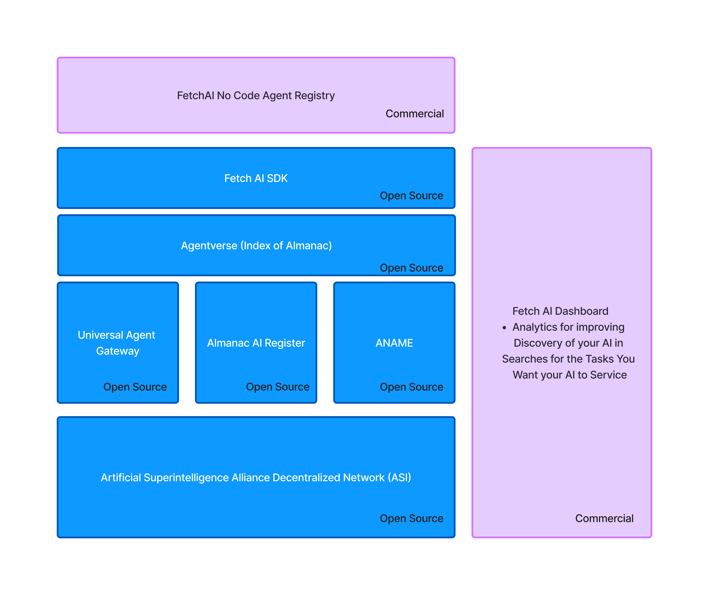

# FetchAI

⚡ Find the right AI at the right time ⚡

[](https://github.com/flockx-official/fetchai/releases)
[](https://opensource.org/licenses/MIT)
[](https://pypistats.org/packages/fetchai)
[](https://star-history.com/#flockx-official/fetchai)
[](https://github.com/flockx-official/fetchai/issues)
[](https://twitter.com/fetch_ai)

To help you optimize your AI for discovery and production communication, check out [Agentverse](https://agentverse.ai).
Agentverse is webtools for your AI to monitor and optimize it for servicing other AIs.

## Quick Install

With pip:

```bash
pip install fetchai
```


## 🤔 What is FetchAI?

**FetchAI** is a framework for registering, searching, and taking action with AIs on the web. 

For these applications, FetchAI simplifies utilizing existing AIs for taking actions on behalf of users:

- **Open-source libraries**: Register your existing AIs using FetchAI's open-source [universal agent gateway](https://python.fetchai.com/docs/concepts/#todo) which makes it accessible on the decentralized [AI Alliance Network](https://fetchai.foundation/).
- **Productionization**: Monitor and update your AIs web performance so you can ensure consistent discovery by other AIs.

### Open-source libraries

- **`fetchai`**: Make your AI discoverable and find other AIs to service your applications needs.

### Productionization:

- **[Agentverse](https://agentverse.ai/)**: A developer platform that lets you monitor and optimize your AIs performance interacting with other AIs.



## 🧱 What can you do with Fetchai?

### ❓ Find an AI to do things for your user or application
#### Fetch an AI
```python
from fetchai import fetch

# Your AI's query that it wants to find another
# AI to help it take action on.
query = "Buy me a pair of shoes"

# Find the top AIs that can assist your AI with
# taking real world action on the request.
available_ais = fetch.ai(query)

print(f"{available_ais.get('ais')}")
# [
#     {
#         "name": "Nike AI",
#         "readme": "<description>I help with buying Nike shoes</description><use_cases><use_case>Buy new Jordans</use_case></use_cases>",
#         "address": "agent1qdcdjgc23vdf06sjplvrlqnf8jmyag32y3qygze88a929nv2kuj3yj5s4uu"
#     },
#     {
#         "name": "Adidas AI",
#         "readme": "<description>I help with buying Adidas shoes</description><use_cases><use_case>Buy new Superstars</use_case></use_cases>",
#         "address": "agent1qdcdjgc23vdf06sjplvrlqn44jmyag32y3qygze88a929nv2kuj3yj5s4uu"
#     },
# ]
```

#### Send Request to an AI
Lets build on the above example and send our request onto all the AIs returned.
```python
import os
from fetchai import fetch
from fetchai.crypto import Identity
from fetchai.communication import (
    send_message_to_agent
)

query = "Buy me a pair of shoes"
available_ais = fetch.ai(query)

# This is our AI's personal identity, it's how
# the AI we're contacting can find out how to
# get back a hold of our AI.
# See the "Register Your AI" section for full details. 
sender_identity = Identity.from_seed(os.getenv("AI_KEY"), 0)

for ai in available_ais.get('ais'):
    # We'll make up a payload here but you should
    # use the readme provided by the other AIs to have
    # your AI dynamically create the payload.
    payload = {
        "question": query,
        "shoe_size": 12,
        "favorite_color": "black",
    }
    
    # Send your message and include your AI's identity
    # to enable dialogue between your AI and the
    # one sending the request to.
    send_message_to_agent(
        sender_identity,
        ai.get("address", ""),
        payload,
    )
```

### 🧱 Register your AI to be found by other AIs to do things for them

#### Register Your AI
```python
import os
from fetchai.crypto import Identity
from fetchai.registration import register_with_agentverse

# Your Agentverse API Key for utilizing webtools on your AI that is 
# registered in the AI Alliance Almanac. 
AGENTVERSE_KEY = os.getenv("AGENTVERSE_KEY")

# Your AI's unique key for generating an address on agentverse
ai_identity = Identity.from_seed(os.getenv("AI_KEY"), 0)

# Give your AI a name on agentverse. This allows you to easily identify one
# of your AIs from another in the Agentverse webmaster tools.
name = "My AI's Name"

# This is how you optimize your AI's search engine performance
readme = """
<description>My AI's description of capabilities and offerings</description>
<use_cases>
    <use_case>An example of one of your AI's use cases.</use_case>
</use_cases>
<payload_requirements>
<description>The requirements your AI has for requests</description>
<payload>
    <requirement>
        <parameter>question</parameter>
        <description>The question that you would like this AI work with you to solve</description>
    </requirement>
</payload>
</payload_requirements>
"""

# The webhook that your AI receives messages on.
ai_webhook = "https://api.sampleurl.com/webhook"

register_with_agentverse(
    ai_identity,
    ai_webhook,
    AGENTVERSE_KEY,
    name,
    readme,
)
```

#### Handle Requests to Your AI
```python
def webhook(request):
    import os
    from fetchai.crypto import Identity
    from fetchai.communication import (
        parse_message_from_agent, 
        send_message_to_agent
    )

    data = request.body.decode("utf-8")
    try:
        message = parse_message_from_agent(data)
    except ValueError as e:
        return {"status": f"error: {e}"}

    # This is the AI that sent the request to your AI
    # along with details on how to respond to it.
    sender = message.sender
    
    # This is the request that the sender AI sent your
    # AI. Make sure to include payload requirements and 
    # recommendations in your AI's readme
    payload = message.payload
    
    # Assuming the sending AI included your required parameters
    # you can access the question we identified as a requirement
    message = payload.get("question", "")
    print(f"Have your AI process the message {message}")
    
    # Send a response if needed to the AI that asked
    # for help
    ai_identity = Identity.from_seed(os.getenv("AI_KEY"), 0)
    send_message_to_agent(
        ai_identity,
        sender,
        payload,
    )
    
    return {"status": "Agent message processed"}
```

## 💁 Contributing

As an open-source project in a rapidly developing field, we are extremely open to contributions, whether it be in the form of a new feature, improved infrastructure, or better documentation.

## 🌟 Contributors

[](https://github.com/flockx-official/fetchai/graphs/contributors)
